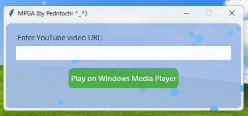

# 🎵 MPGA – Media Player Great Again 🎵

A clean, nostalgic Windows GUI app to **stream audio from YouTube** directly into **Windows Media Player**, built with Python and `yt-dlp`.

Made by **Pedritochi ^_^**  
Stylized with a touch of **Frutiger Aero** aesthetic ✨


---

## 🧠 What does it do?

MPGA takes any valid **YouTube video URL**, extracts the best audio stream via `yt-dlp`, and plays it **instantly on Windows Media Player**. No downloads, no clutter.

---

## 🖼️ UI Preview


(

---

## 🔧 Requirements (Python Version)

- Python 3.7+
- [`yt-dlp`](https://github.com/yt-dlp/yt-dlp) installed (`pip install yt-dlp`)
- Windows Media Player installed and enabled
- Works on Windows 7, 10, and 11

---

```markdown
## 🛠️ How to Run

Run it with Python:

```bash

> _Or download the .exe version
